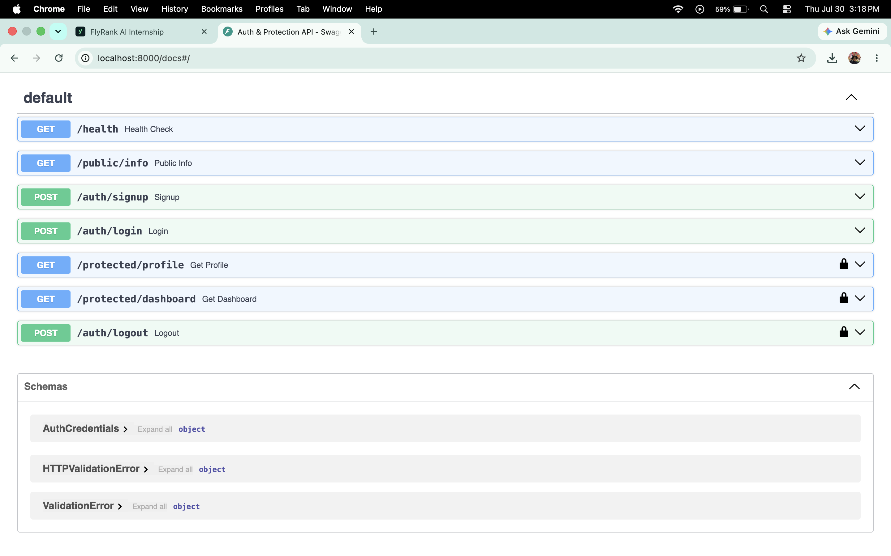
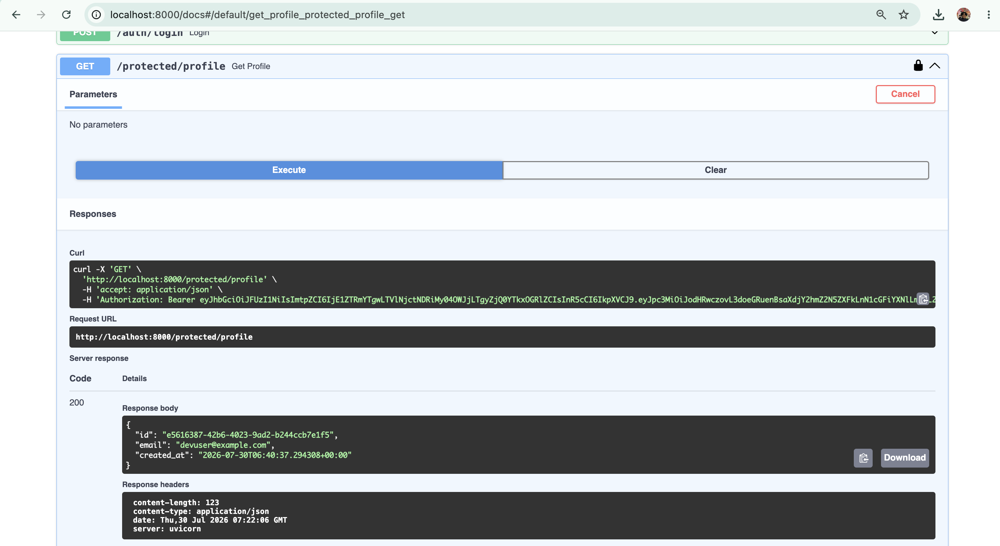

My first CRUD API


This image is Basically the 5th stage

Aside from the resources given, this is also an additional resource I used that helped me (https://www.youtube.com/watch?v=Lw-zLopB3o0&start=0)

<<<<<<< HEAD

Connecting to the database Stage 5 — Database Documentation

1. Why SQLite Was Chosen
SQLite was selected for this project because:
It is a serverless, self-contained database that requires no external database server or background services (like Docker or PostgreSQL) to run.
It runs directly inside Python's built-in standard library (`sqlite3`), making setup instant across any machine.
Data is stored in a single cross-platform file, making it ideal for local testing and lightweight backend applications while demonstrating true persistent storage across server restarts.

2. Where the Database File Is Stored
`./tasks.db` (stored in the root directory of the project folder).
The file is ignored by Git (`.gitignore`) so each environment maintains its own instance. On the application's first boot, the startup hook automatically detects if `tasks.db` exists; if missing, it creates the file, builds the `tasks` schema, and seeds the initial 3 example records.

3. How to Start the Project
First you have to clone the repository and enter the directory:
   ```bash
   git clone [https://github.com/ZeroTechno/Task.git](https://github.com/ZeroTechno/Task.git)
   cd Task


4. Screenshots of my database viewer


5. One example SQL query you executed
SELECT * FROM tasks WHERE done = 1;
I used it to retrieve all completed tasks from the database during the manual inspection.
=======
# FastAPI Authentication & Route Protection with Supabase

A secure backend API built with FastAPI and Supabase Auth as the Identity Provider (IdP). This project demonstrates modern web security principles, using JSON Web Tokens (JWT) for user authentication and Bearer Tokens for protected route authorization.

---

## What This Project Is

This API provides user account management (Sign Up, Log In, Log Out) and enforces access control across endpoints. Public endpoints are accessible to anyone, while protected endpoints require a valid JWT issued by Supabase Auth and passed in the HTTP `Authorization: Bearer <token>` header.

Key security features include:
* Identity Provider Integration: Offloads password hashing, user registration, and session token generation to Supabase Auth.
* Token Verification Middleware: Uses FastAPI's dependency injection (`Depends`) to extract and verify JWT tokens against Supabase before serving protected routes.
* Interactive API Security: Configures `HTTPBearer` security schemes in Swagger UI (`/docs`) to test protected endpoints with Bearer tokens directly from the browser.
 
---

## How to Set Up Local Environment Variables

1. Create a `.env` file in the root directory of the project:
   ```bash
   touch .env

2. Open .env and add your Supabase credentials (found in your Supabase Dashboard -> Project Settings -> API):
SUPABASE_URL=[https://your-project-ref.supabase.co](https://your-project-ref.supabase.co)
SUPABASE_KEY=your-actual-anon-key-here

## To run through Project
1. Install the dependencies:
pip3 install fastapi uvicorn supabase python-dotenv pydantic

2. Start the server:
python3 -m uvicorn main:app --reload

3. Access the application
Server URL: http://127.0.0.1:8000
Swagger: http://127.0.0.1:8000/docs

Endpoint		Method	Auth Required		Description
/health			GET	No			Basic health check route
/public/info		GET	No			Open endpoint returning public information
/auth/signup		POST	No			Registers a new user account with Supabase Auth
/auth/login		POST	No			Authenticates credentials and returns JWT Bearer token
/auth/logout		POST	Yes (Bearer)		Terminates active session and invalidates token
/protected/profile	GET	Yes (Bearer)		Returns authenticated user profile metadata
/protected/dashboard	GET	Yes (Bearer)		Returns protected user dashboard data




